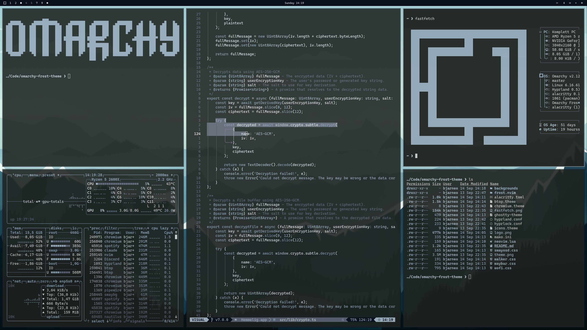

# ❄️ Fryst

Fryst is a dark, elegant, and calm theme for **Omarchy**, forged from the quiet strength of Nordic winters.  
It’s inspired by the serenity of ice, the stillness of snow, and the clarity that emerges when the world turns cold and silent.

<p align="center">
  
</p>

---

## 🧊 About

**Fryst** is a fork of [**Omarchy Frost Theme**](https://github.com/bjarneo/omarchy-frost-theme) by [**@bjarneo**](https://github.com/bjarneo),  
with gratitude for the original inspiration and palette design.  

This version continues the lineage of *Frost*, expanding the idea into a wider ecosystem —  
bringing its clean, icy aesthetic to more of the web I live and create in.

---

## 🌨️ Scope

Fryst will gradually extend beyond Omarchy to include **custom Stylus themes** for:

1. [ChatGPT](https://chat.openai.com)  
2. [GitHub](https://github.com)  
3. [Notion](https://notion.so)

*(Still on the TO-DO list — but coming soon, one snowflake at a time.)*

---

## 🌬️ Installation (Omarchy)

```bash
omarchy-theme-install https://github.com/yourname/omarchy-fryst-theme
````

---

## 🧠 Neovim Theme

See the `fryst.nvim` folder for the Neovim color configuration.

---

## 🩵 Personal Note

My favorite color has always been **frosty blue** — that in-between shade where cold meets calm.
Even though I’m as color-blind as one can be (and can hardly tell purple from blue),
I love the feeling this hue gives me: like a **white winter morning**, quiet and alive at once.

---

## 🌌 Credits

* **Original Theme:** [Omarchy Frost Theme](https://github.com/bjarneo/omarchy-frost-theme)
* **Author:** [@bjarneo](https://github.com/bjarneo)
* **Fork & Expansion:** [@IO-YO](https://github.com/IO-YO)

---

<p align="center">
  
</p>

---
